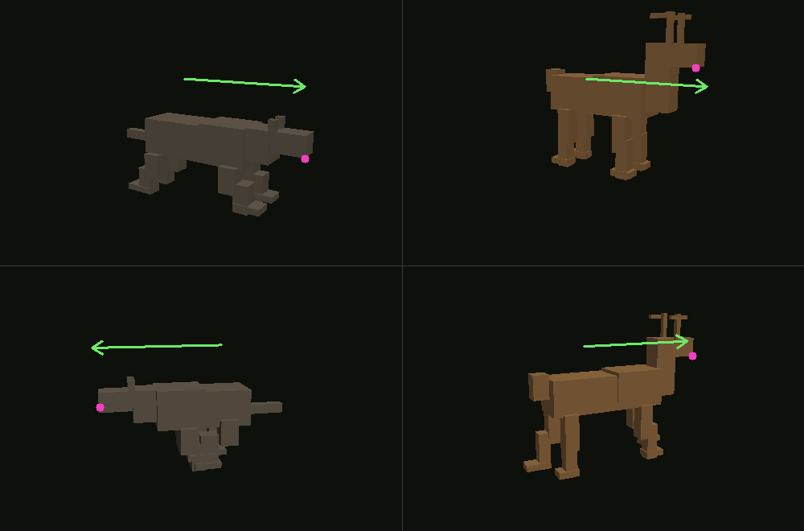

# Pack Hunt 3D

Wolves and deer with an energy and gait model, in 3D. Godot 4 / GDScript,
exported to WebAssembly.

A **second, independent implementation** of
[`nathandunn/pack-hunt`](https://github.com/nathandunn/pack-hunt) — same design
spec, same constants, same utility weights, different language and engine. The
canvas/TypeScript build is the source of truth; this one is ported from it
formula for formula and the divergences are listed below.

Live: <https://pack-hunt-3d.apps.precogsoftwareservices.com>

## The game

A deer spawns near the right edge of a 225 m x 130 m plain and must reach the
left edge. Five wolves spawn as a loose cordon between it and the goal.
Reaching the left edge is a deer win; a wolf getting within twelve sim units
(3 m) is a wolf win.

## Energy and gaits

Derived in [`specs/pack-hunt-energy.md`](specs/pack-hunt-energy.md), which was
written from the field literature before either implementation existed. The
one hard measurement underneath it is Bryce & Williams 2017 (*J. Exp. Biol.*
220:312) — cost of transport for northern-breed dogs, whose hip angle is
statistically indistinguishable from a grey wolf's.

| | speed (units/tick) | cost/s | a full tank lasts |
|---|---|---|---|
| wolf walk | 0.173 | −0.0036 | ∞ (refills in 279 s) |
| wolf trot | 0.293 | −0.0033 | ∞ (refills in 301 s) |
| wolf gallop | 1.267 | +0.0024 | 414 s |
| wolf sprint | 2.147 | +0.1111 | **9 s** |
| deer walk | 0.173 | −0.0007 | ∞ |
| deer trot | 0.400 | −0.0002 | ∞ |
| deer bound | 0.933 | +0.0400 | 25 s |
| deer gallop | 1.800 | +0.0121 | 83 s |
| deer sprint | 2.080 | +0.1111 | **9 s** |

Two things fall out of that table which are the whole model:

* **The deer is slightly *slower* than the wolf flat out** — 56 km/h against
  58–61. SPEC v0.4's fixed 2× ratio is gone; the asymmetry that makes the game
  is cost, not pace.
* **A wolf refills its tank in 217 s and a deer needs 789.** A wolf that empties
  itself is trotting again in four minutes. A deer that empties itself may not
  recover at all — that is what the capture-myopathy literature says happens to
  an over-exerted cervid.

`bound` is deliberately **slower than a gallop and four times dearer**, because
Lingle 2002 found that stotting does not outrun a coursing predator on open
ground. It only pays on broken terrain, so the five deadfall patches — which a
bounding deer crosses and every wolf must go around — are the only thing that
makes it rational.

## Formula divergences from the canvas build

1. **Transcendentals.** `exp` (softmax), `sin`/`cos`/`atan2` (steering, cover
   incidence) come from V8 there and from libm here. The softmax draw is a
   threshold on an accumulated probability, so a last-ulp difference eventually
   separates two runs completely. **Bit-identical replay across the two
   implementations is not available at all**, and no amount of care elsewhere
   would recover it.
2. **`Math.hypot` vs `sqrt(x*x+y*y)`** — same formula, computed the plain way.
3. **No `Vector2` anywhere in the simulation.** Godot's `Vector2` is float32 in
   a standard build. Routing a position through one silently rounded it to
   seven digits and put every deer step 6.5e-7 units off its gait speed — a
   divergence with nothing to do with libm. The geometry helpers return through
   module-level `OUT_X`/`OUT_Y` doubles instead.
4. **Consideration order is per candidate.** The TS build sums each candidate's
   considerations by walking `Object.entries`, which is the order the keys were
   written in that object literal — and in Pack Hunt that order differs between
   candidates. Floating-point addition is not associative, so each candidate
   here carries its own (trait, weight) list in the JS literal's order.
5. **No sim-core, no agent-forge.** The mulberry32 Rng, `utilityDecide` and the
   two geometry primitives are ported into `scripts/`. `simulate`'s trial loop
   is in `scripts/batch.gd`, using agent-forge's `seedBase + i` numbering, so
   batches line up trial for trial.

## Rendering

### Colour

The whole palette is `scripts/palette.gd` and nothing else in the project may
name a colour — `_test_palette_contrast` greps `ui/` for a literal `Color(…)`
and fails on one.

Every element a viewer has to pick out clears **WCAG 3:1** against the ground,
which is the bar for non-text graphical objects, and the test checks it rather
than the comment claiming it:

| | hex | vs ground |
|---|---|---|
| ground | `#34412b` | — |
| wolf | `#dfe2db` | 8.28 : 1 |
| deer | `#dd8f4e` | 4.19 : 1 |
| deadfall | `#c89a55` | 4.24 : 1 |
| deadfall top | `#e3c489` | 6.47 : 1 |
| goal strip | `#8ed07a` | 5.91 : 1 |

Wolf against deer is only 1.98 : 1 in luminance and that is deliberate: the two
species separate on **hue** — neutral grey against warm tan — which survives
daylight and the common forms of colour blindness where a luminance-only split
does not. What must not happen is either sinking into the field.

Fatigue used to multiply the coat by as little as 0.55, which took a spent deer
to 2.31 : 1 — least visible exactly when the chase is decided. It now
interpolates toward a *spent* tone of the same lightness, and the test walks the
whole 0→1 ramp.

`docs/palette-before.png` and `docs/palette-after.png` are the same four frames
under the old colours and the new ones.

Two `MultiMeshInstance3D`s — one per species — and two draw calls at any animal
count. Both animals are built in code (`scripts/meshes.gd`): a handful of boxes
welded into one `ArrayMesh` each. Nothing is imported from outside this repo.

The gait animation is a **vertex-shader displacement**, because a MultiMesh
gives every instance one transform and limbs cannot be posed per instance from
GDScript. Every vertex carries its swing weight and leg index in `UV2`; every
instance carries phase, swing amplitude, footfall pattern and body flex in four
floats of custom data. So a walking wolf, a galloping wolf and a bounding deer
are all the same draw call.

The **vertical of a bound is not in the shader** — it is in the instance
transform, because a leap has to move the whole animal and cast its shadow from
somewhere other than its feet.

### The deadfall blocks were black

Fixed 2026-09-11, after a phone report that the obstacle blocks rendered black
and blinked in and out as the camera moved. Two independent faults, either of
which produces it on its own:

1. **Every box in the project was wound inside-out.** Godot's front face is the
   clockwise winding — a correctly wound triangle has `(p1-p0) × (p2-p0)`
   pointing *away* from its own normal, which you can confirm by measuring the
   engine's own `BoxMesh`, and `_test_winding` does exactly that rather than
   trusting the claim. `Meshes._box` emitted the other one, so
   `StandardMaterial3D`'s default `cull_back` threw away every outward face of
   every deadfall patch and drew only the far interior ones: normals pointing
   away from the sun, hence black, and a different subset winning the depth test
   from every angle, hence blinking. The animals were exempt for one reason —
   `ui/animals.gdshader` is `render_mode cull_disabled`.
2. **The slab sat flat on the floor.** Its underside was at exactly `y = 0`,
   coplanar with the ground plane. Two coplanar surfaces 200 m from the camera
   are a depth-precision coin toss that lands differently as the view moves.
   `Meshes.BASE_Y` lifts it clear.

Also hardened while in there: the two `MultiMeshInstance3D`s now carry an
explicit `custom_aabb` covering the plain, so a stale batch AABB cannot cull the
whole herd at some angle, and the sun's shadow range covers the field instead of
stopping 100 m out.

The check that keeps it fixed is `scripts/blocks.gd`, run by `./test.sh`: it
rasterises the field from three camera angles and asserts every patch puts
pixels on the screen, that none of them are below a brightness floor, and that
90% of them clear 3:1 against the grass. It culls back faces **on the projected
winding, the way the GPU does** — culling on the vertex normal would have drawn
the broken mesh happily and proved nothing.

`--legacy` rebuilds both faults so the before and after PNGs come out of one
renderer: `docs/blocks-before.png` (30–32 of 60 triangles survive, every
obstacle pixel below 0.12 value) and `docs/blocks-after.png` (448–450 triangles,
98%+ clearing 3:1).

### Which way an animal points

Fixed 2026-09-10, after a report that deer and wolves ran backwards on a phone.
Two separate sign errors, both in this section of the code:

* **The instance basis.** The meshes are built nose-toward `-Z`, which is
  Godot's forward. The sim's heading `h` travels along world `(cos h, 0, sin h)`,
  and `Basis(Vector3.UP, t)` carries `-Z` onto `(-sin t, 0, -cos t)`, so the
  rotation is `t = -h - π/2`. The build shipped `-h + π/2`: the same vector
  negated, so every animal on the field faced exactly 180° away from its travel.
* **The leg cycle.** A leg lifts while it swings *forward* and stays planted
  while it travels aft under the body. The lift term is `max(0, sin)` — the first
  half of the cycle — so the fore-and-aft term has to be forward over that same
  half, and forward is `-Z`. The shader had `VERTEX.z += weight * swing`, which
  put the lift on the stance half instead: the feet skated forward on the ground
  and picked up on the way back.

Both are now asserted headlessly (`_test_facing`, `_test_gait_cycle`), and there
is a picture:

```bash
godot --headless --script res://scripts/preview.gd -- --preview docs/facing.png
godot --headless --script res://scripts/preview.gd -- --legacy --preview docs/palette-before.png
godot --headless --script res://scripts/blocks.gd -- --png docs/blocks-after.png
godot --headless --script res://scripts/blocks.gd -- --legacy --png docs/blocks-before.png
```



Four panels — wolf and deer, two headings each. The green arrow is
`Field.travel_dir(h)`; the magenta dot is the animal's nose. Nose at the
arrowhead is the whole test. `scripts/preview.gd` is a software rasteriser
rather than a screenshot because `--headless` gives Godot the dummy rendering
driver: there is no viewport to capture and no GLSL to run. It takes the mesh,
the gait displacement and the instance basis from exactly the code the app
ships, so if the app faces the wrong way, so does the picture.

The one thing that cannot be shared is the gait maths itself, which has to live
in GLSL to stay at two draw calls. `scripts/gait.gd` mirrors it for the preview
and the tests, and `_test_shader_matches_gait` reads the shader source and
asserts the mirrored lines are still the ones in it.

## Camera

**Fixed** 45° elevation looking at the herd. There is no orbit.

* **mouse** — drag pans, wheel zooms
* **touch** — one finger pans, two fingers pinch to zoom
* **Home view** puts it back

The orbit control was removed in 2026-09-11, not hidden: `PITCH` and `YAW` are
`const` in `ui/camera.gd` and `_test_camera_is_fixed` asserts there is no orbit
handler and that a synthetic one-finger drag pans rather than rotates. It went
because it was the wrong control for this app on a phone — the thing worth
watching is a chase across a 225 m plain, one finger dragging spun the world
away from it, and that same gesture was the one people were reaching for to
move the map.

## Parity with the canvas build

Sixty trials, `teamplayer` wolves against a `defender` deer, 5v1, seeds
20260910-69, both run headless. `./test.sh --parity 60` here and
`node tools/parity.mjs 60 20260910` there print these fields in this order.

| | Godot | JS | |
|---|---|---|---|
| deer win rate | 0.767 | 0.750 | +2% |
| kill rate | 0.233 | 0.250 | −7% |
| mean hunt (ticks) | 1440 | 1526 | −6% |
| mean chase (ticks) | 1223 | 1308 | −6% |
| deer energy at the outcome | 0.236 | 0.218 | +8% |
| pack energy at the outcome | 0.962 | 0.967 | −0.5% |
| wolf trot / gallop share | 0.158 / 0.831 | 0.149 / 0.841 | within 1 pp |
| deer gallop / sprint / bound share | 0.858 / 0.042 / 0.035 | 0.859 / 0.040 / 0.033 | within 0.3 pp |
| decided by a deer gallop | 43 of 60 | 41 of 60 | |
| decided by a wolf gallop | 12 of 60 | 14 of 60 | |
| runs stopped by the backstop cap | 1 | 2 | |

The gait shares are the interesting row: they agree to within a percentage
point on every gait including the rare ones, which is what says the two builds
are running the same energy model and not merely landing on similar win rates.

## Performance

`./test.sh --perf`, mean cost of one simulation tick on the hub against the
16.67 ms a 60 Hz frame allows:

| animals | ms/tick |
|---|---|
| 5 wolves + 1 deer | 0.37 |
| 80 wolves + 20 deer | 8.14 |
| 50 wolves + 50 deer | 9.27 |

**These are native numbers — the in-browser figure is not measured**, because
there is no browser on the build host. Built in for that: the playback loop
runs whole ticks from the frame delta with a hard catch-up cap, so a slow
device plays the hunt back in slow motion rather than skipping it, and simulate
mode slices its trials across frames on a 9 ms budget so the tab never blocks.

## Build and test

```bash
./test.sh                # the headless suite
./test.sh --perf         # tick cost at 100 animals against the 16.67 ms budget
./test.sh --parity 6     # the table this README's parity section quotes
./build.sh               # web export into dist/

godot --headless --script res://scripts/preview.gd -- --preview docs/facing.png
godot --headless --script res://scripts/preview.gd -- --legacy --preview docs/palette-before.png
godot --headless --script res://scripts/blocks.gd -- --png docs/blocks-after.png
godot --headless --script res://scripts/blocks.gd -- --legacy --png docs/blocks-before.png
```

Needs Godot 4.7.2 and the matching web export templates —
`hub-orchestrator/scripts/godot-install.sh` installs both.
